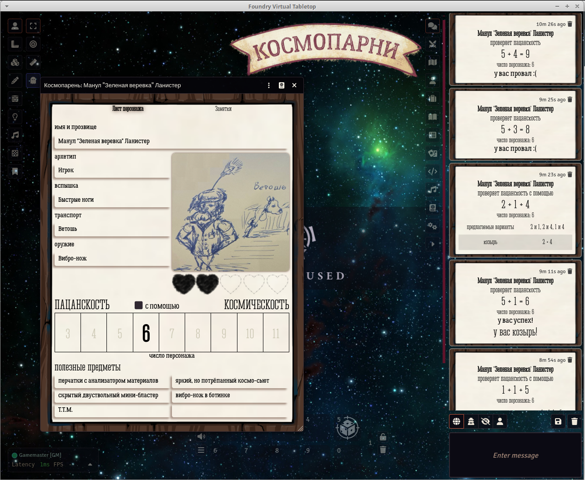

# fvtt-cosmoboys

Системя для НРИ Космопарни на [Foundry VTT v13+](https://foundryvtt.com/ "Что ещё за фаундри такой?") на русском языке. 

Пакет разработан под руководством авторов игры [Студии «Просто Ё»](https://t.me/studio_prostoe "Канал в Telegram")

Книга правил https://rpgbook.ru/PE_Kosmoparni  

Возможности:

- [x] Лист персонажа
- [x] Броски на пацанскость и космическость
- [x] Броски с помощью союзника
- [x] Русскоязычные компендумы и локализация
- [x] Макрос для генерирования приключения
- [x] Интерактивный счетчик ранений. Левый клик убирает 1 сердечко, правый - добавляет. 
- [x] Интерактивное число персонажа. Левый клик переключает на выбранное.
- [x] Генерация нового персонажа по кнопке

«Космопарни» — это небольшая игра про космических ковбоев, вдохновлённая фантастическими мультфильмами эпохи VHS-кассет, спагетти-вестернами и музыкальными клипами Muse — «Knights of Cydonia» и Falling in Reverse — «All my Life».

Примерьте на себя роли отважнейших героев космического фронтира — космопарней (или космодевчат, на ваш выбор) — и отправьтесь в безбашенные приключения по не такому уж и пустому космическому пространству!

